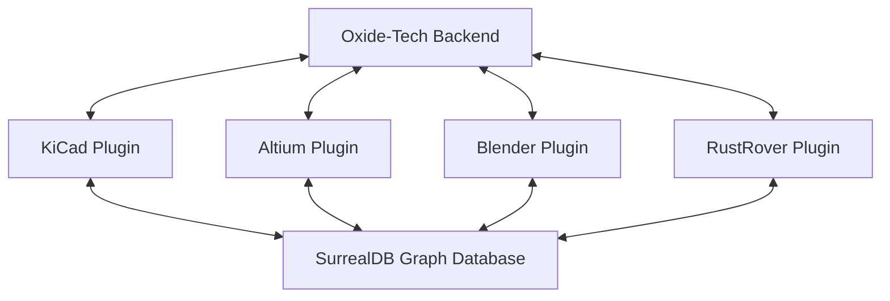

# Oxide-Tech Plugin Workspace Upgrade User Guide

Welcome to the upgraded Oxide-Tech Plugin ecosystem! This workspace integrates specialized hardware engineering and CAD tools (KiCad, Altium, Blender, and JetBrains RustRover) with the Oxide-Tech graph database and AI inference engine.

---

## 🔌 Plugin Directory & Architecture



Each plugin functions as a bridge translating native application events and layouts to unified data models synchronized with our database.

---

## 🟢 1. KiCad Plugin (`oxide-piugin-kicad`)

The KiCad integration enables SKiDL schematic generation, GNN layout placement, and bidirectional sync.

### Features
* **SKiDL Schematic Generator (`schematic_generator.py`)**: Prompts the AI (Qwen-32B) to generate SKiDL code, executes it in a docker sandbox, runs Electrical Rules Check (ERC), auto-heals any ERC violations, and uploads the netlist.
* **PCB Layout Controller (`pcb_layout.py`)**: Applies AI-optimized positioning to board footprints and configures critical high-speed trace classes according to target impedance.
* **Sync Manager (`sync_manager.py`)**: A WebSocket service that listens to graph changes in SurrealDB and updates footprints/nets in the open board view in real-time.

---

## 🟡 2. Altium Plugin (`oxide-plugin-altium`)

The Altium integration bridges design formats via IPC-2581 files and uses COM Automation on Windows.

### Features
* **IPC-2581 Bridge (`src/ipc2581_bridge.rs`)**: A Rust library that handles bi-directional KiCad and Altium project transfers by converting schematic/PCB formats.
* **COM Automation Bridge (`AltiumCOM/AltiumBridge.cs`)**: A Windows C# library that automates Altium's application to load/save imported IPC-2581 files and execute Design Rule Checks (DRC).

---

## 🔵 3. Blender Plugin (`oxide-plugin-blender`)

The Blender plugin generates enclosures and performs GNN thermal checks.

### Features
* **Parametric Enclosure Generator (`parametric_cad.py`)**: Queries PCB board bounding dimensions and automatically constructs 3D casing bodies with cutout clearances for edge connectors.
* **Thermal Solver (`thermal_solver.py`)**: Runs steady-state heat equation simulations on the GPU/CPU using NVIDIA Warp kernels, mapping dissipated heat zones to the PCB mesh.

---

## 🔴 4. RustRover Plugin (`oxide-plugin-rustrover`)

The JetBrains plugin provides deep inference integration inside the Rust IDE workspace.

### Features
* **Oxide API Client (`OxideTechClient.kt`)**: Implements coroutine-based OkHttp streaming for ornith-35b completion models.
* **MCP Tool Panel (`McpToolPanel.kt`)**: A Swing UI panel that allows programmers to call MCP server actions (like flashing firmware) with human-confirmation prompt guards before executing.

---

## 📦 Sandbox Setup (Docker)

To build the sandboxes for SKiDL schematic compilation and Blender rendering:

### KiCad Sandbox
```bash
docker build -t oxide/kicad-sandbox:latest sandboxes/kicad/
```

### Blender Sandbox
```bash
docker build -t oxide/blender-sandbox:latest sandboxes/blender/
```

---

## 🧪 Running Integration Tests

You can verify all components using the bundled test suites:

### Rust Crates Test
```bash
cargo test
```

### KiCad & Blender Tests
```bash
python3 -m unittest oxide-piugin-kicad/tests/test_kicad.py
python3 -m unittest oxide-plugin-blender/tests/test_blender.py
```
